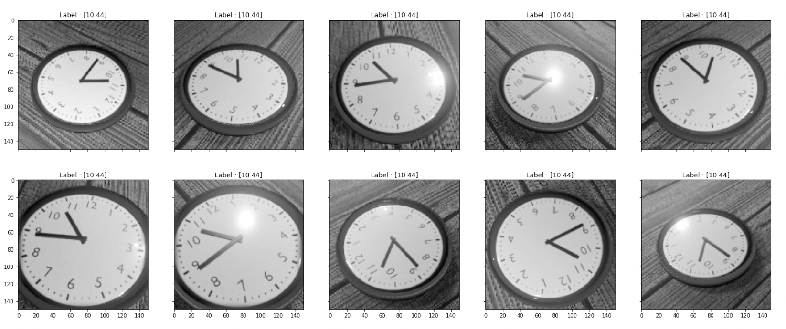

# Clock time prediction neural network

Given a dataset of images of clocks in various orientations and angles, our aim is to predict the exact time (hours and minutes). 

A variety of regression, classification, and multi-head convolutional neural networks (CNN) was implemented for experimentation, while different labels representations and loss functions were used.

## Regression CNN
The following sequence of experiments was performed:
- predicting time using decimal representation and MAE
- predicting time using decimal representation and custom 'common-sense' loss
- predicting only hours with the custom 'common-sense' loss
- predicting only minutes with the custom 'common-sense' loss
- predicting time using cyclical representation of the output (hours and minutes labels have a cyclical relationship and can be represented using sine and cosine)

## Classification CNN
- predicting hours and minutes as 24 classes, one for each 30 minutes
- predicting hours and minutes as 72 classes, one for each 10 minutes
- predicting hours as 12 classes

## Multi head model
- predicting hours as classification task and minutes as a regression task by using a multi-head network